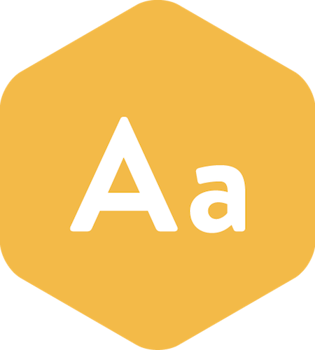

# Typogrify plugin for Craft CMS 3.x

Typogrify prettifies your web typography by preventing ugly quotes and 'widows' and more



## Requirements

This plugin requires Craft CMS 3.0.0-beta.23 or later.

## Installation

To install the plugin, follow these instructions.

1. Open your terminal and go to your Craft project:

        cd /path/to/project

2. Then tell Composer to require the plugin:

        composer require nystudio107/craft3-typogrify

3. In the Control Panel, go to Settings → Plugins and click the “Install” button for Typogrify.

## Typogrify Overview

Typogrify takes text, rich text, or HTML, and applies typographic best practices to make it look beautiful for display on the web.

It does things like smart "curly" printer's quotes, en-dash & em-dash, language-specific hyphenation, handles "widows", and a whole lot more.

It allows you to "client-proof" sites by applying all of these typographic nicities to text before it's displayed, no matter where the text comes from.

This plugin is roughly a Craft 3 port of Jamie Pittock's wonderful [Craft-Typogrify](https://github.com/jamiepittock/craft-typogrify) plugin for Craft 2.x, and uses the [php-typography](https://github.com/debach/php-typography) and [php-smartypants](https://github.com/michelf/php-smartypants) to do its thing.

## Configuring Typogrify

There's no configuration necessary for Typogrify, but it does provide a `config.php` file that you can use to tweak its behavior to your heart's content.

If you want to change Typogrify's default settings, copy the `src/config.php` it to `craft/config` as `typogrify.php` and make your changes there.

Once copied to `craft/config`, this file will be multi-environment aware as well, so you can have different settings groups for each environment, just as you do for `general.php`.

## Using Typogrify

Typogrify provides two filters for prettifying your text:

### typogrify

Uses [php-typography](https://github.com/debach/php-typography) to apply typographic best practices to text, rich text, and HTML.

Usage:

```
{{ content |typogrify }}
```

Or:

```

    <p>Your text here</p>


```

So what does it actually do? Well, a lot:

- curl quotemarks
- replaces "a--a" with En Dash " -- " and "---" with Em Dash
- replaces "..." with "…"
- replaces "creme brulee" with "crème brûlée"
- replaces (r) (c) (tm) (sm) (p) (R) (C) (TM) (SM) (P) with ® © ™ ℠ ℗
- replaces 1*4 with 1x4, etc.
- replaces 2^4 with 2<sup>4</sup>
- replaces 1/4  with <sup>1</sup>&#8260;<sub>4</sub>
- wrap numbers in `<span class="numbers">`
- single character words are forced to next line with insertion of `&nbsp;`
- fractions are kept together with insertion of `&nbsp;`
- units and values are kept together with insertion of `&nbsp;`
- Em and En dashes are wrapped in thin spaces
- Remove extra space characters
- enables widow handling
- enables wrapping at hard hyphens internal to a word with the insertion of a zero-width-space
- enables wrapping of urls
- enables wrapping of email addresses
- wrap ampersands in `<span class="amp">`
- wrap caps in `<span class="caps">`
- wrap initial quotes in `<span class="quo">` or `<span class="dquo">`
- wrap numbers in `<span class="numbers">`
- enables language-aware hyphenation of text via `&shy;`

...and more. If you don't like the default behavior, you can enable, disable, or change any of the settings via the `config.php` file. See the **Configuring Typogrify** section for details.

### smartypants

Applies [smarty pants](https://github.com/michelf/php-smartypants) to curl quotes.

The `smartypants` filter is provided primary to make upgrading sites from Craft 2.x to Craft 3.x easier, if you were using the Craft 2.x Tyopgrify plugin already. The `typogrify` filter does everything that the `smartypants` filter can do, and more.

Usage:

```
{{ content |smartypants }}
```

Or:

```

    <p>Your text here</p>


```

## Advanced Usage

Should you need advanced control over Typogrify in your templates, you can use the `getPhpTypography()` Twig function:

```

```

This returns a `\Debach\PhpTypography\PhpTypography` object to your templates that Typogrify uses to do its thing. Then you can do advanced or dynamic configuration changes such as:

```


```

...or anything else you care to do. See the [PhpTypography class](https://github.com/debach/php-typography/blob/master/PhpTypography.php) for details.

## Typogrify Roadmap

Some things to do, and ideas for potential features:

* Release it

Brought to you by [nystudio107](https://nystudio107.com/)
